# ⚡ EV Charge Finder

A full-stack web app that helps EV drivers find nearby charging stations and parking spots in real time, compare pricing and availability, and pay directly through an in-app wallet.

Built as a demonstration project to showcase full-stack development skills (React, PHP, MySQL) ahead of campus recruitment — with a focus on writing real, understood logic rather than copy-pasted code.

> 🔗 **Live demo:** _not deployed — see [Deployment](#deployment) below_

---

## 📸 Screenshots

| Home -> 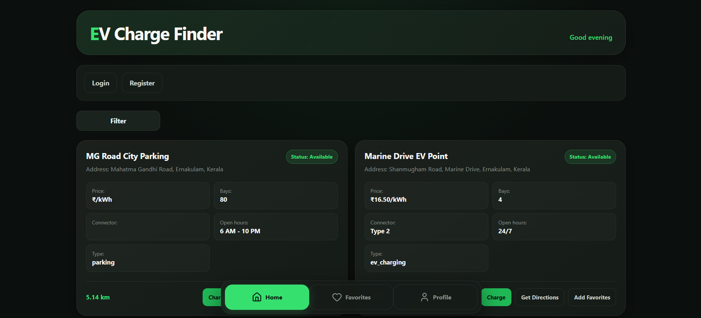 |

| Nearby Stations -> 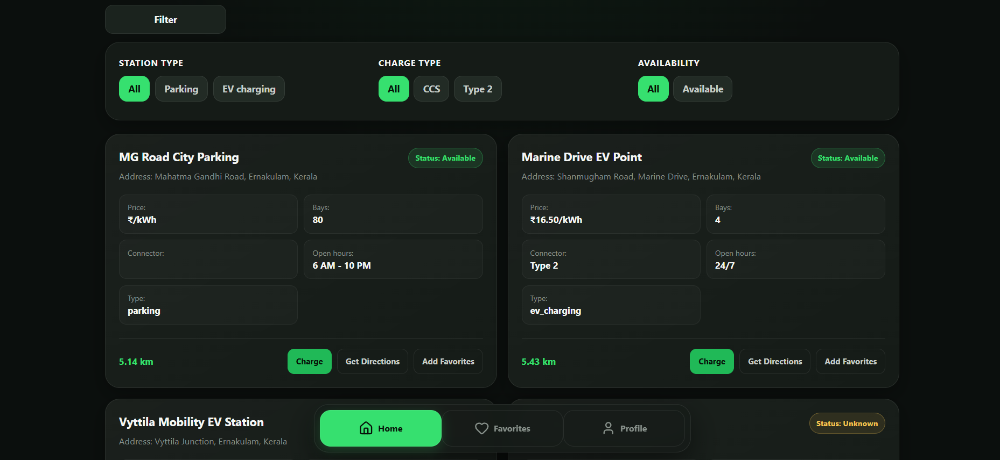,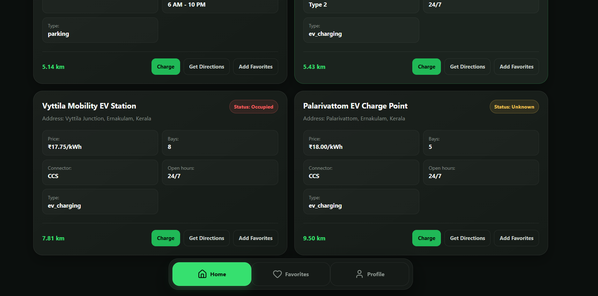|

| Registration -> 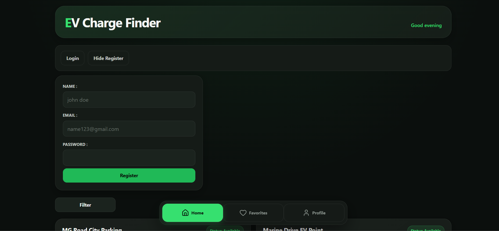|

| Login -> 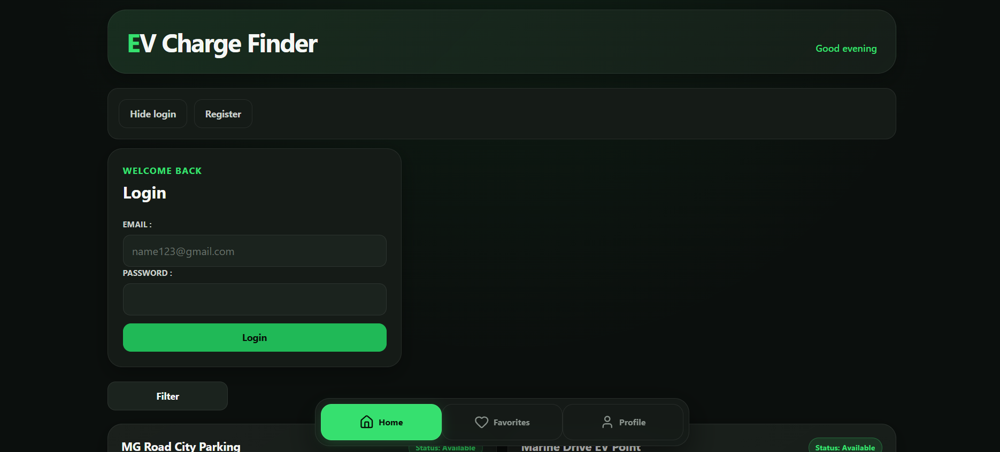|

| Profile -> 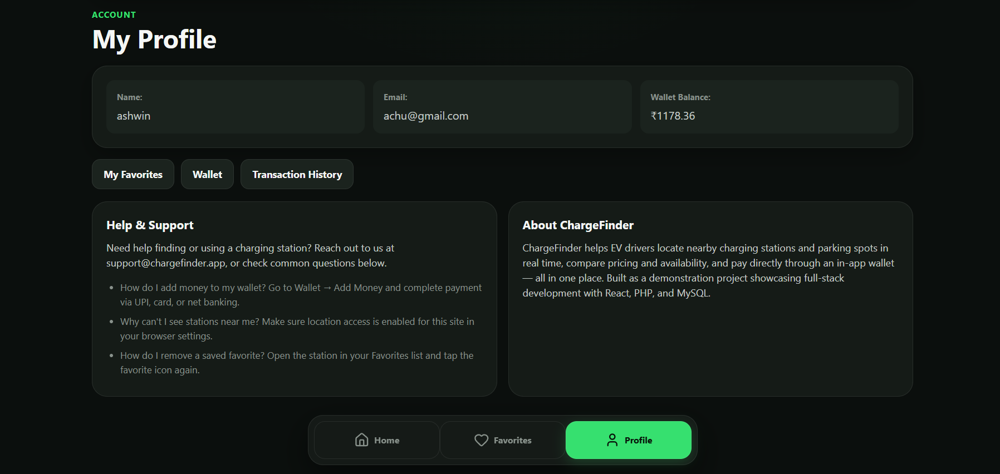|

| Wallet -> 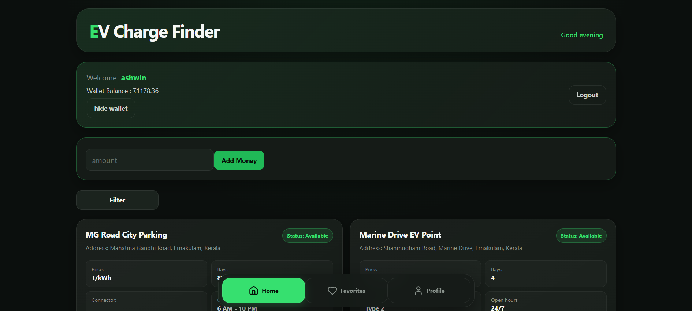|

| Payment Flow -> 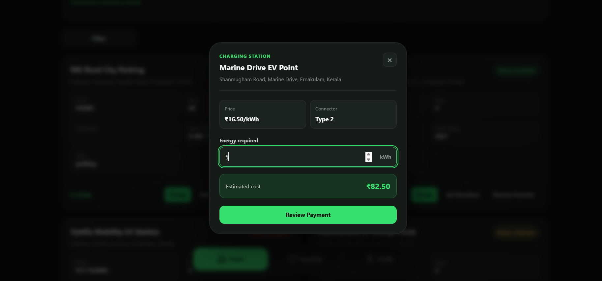,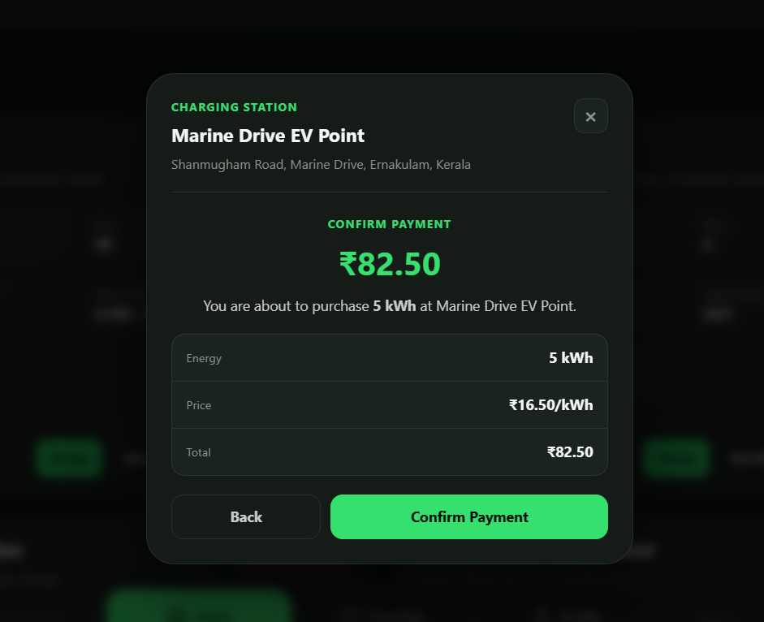,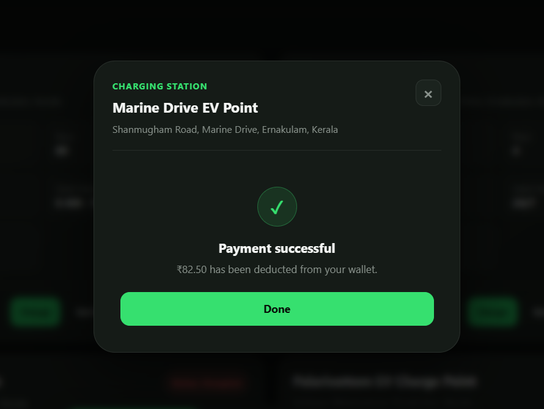 |

| Transaction History -> 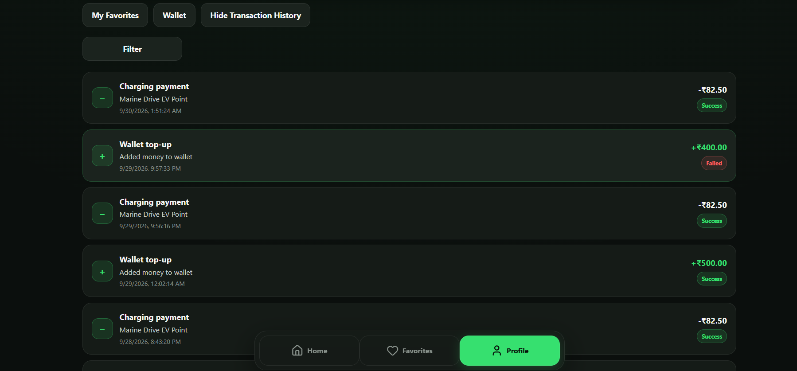|

| Favorites -> 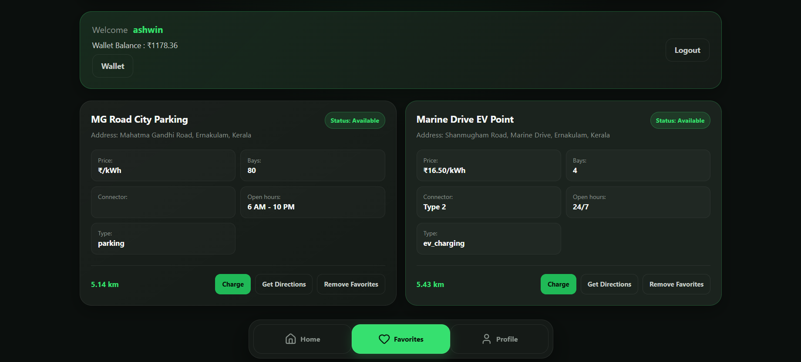 |

---

## ✨ Features

- **Nearby station search** — geolocation-based search using a SQL-side Haversine distance query, with client-side filtering by station type, connector type, and availability
- **Authentication** — session-based login/register with `password_hash`/`password_verify`, no third-party auth libraries
- **Favorites** — add/remove stations, dedicated favorites view
- **Wallet system** — in-app balance, top-ups via Razorpay Checkout (UPI/cards/net banking), with HMAC-SHA256 signature verification and atomic balance updates
- **Pay at station** — charge sessions are billed by energy requested (kWh), with the actual ₹ amount always calculated **server-side** from the station's real price — the frontend estimate is for display only and is never trusted for the transaction
- **Transaction history** — paginated, filterable by type (top-up/payment) and status (success/failed/pending)
- **Responsive design** — mobile-first layout with a bottom navigation bar on small screens, adapting to a standard layout on desktop

---

## 🛠️ Tech Stack

**Frontend**
- React (Vite)
- Context API for auth/wallet state
- `lucide-react` for icons
- Plain CSS with a token-based design system (no framework)

**Backend**
- PHP (no framework — flat files, PDO with prepared statements throughout)
- Session-based authentication
- Razorpay Checkout API for payments

**Database**
- MySQL

---

## 🧠 Key Design Decisions

A few choices worth calling out, since they were made deliberately given the project's timeline and goal (demonstrating implementation skill, not building a production payment system):

- **React + PHP + MySQL instead of the full MERN stack** — chosen to move faster ahead of a recruitment deadline while still demonstrating full-stack ability across a non-JS backend.
- **Station payments are wallet-only, not a fresh Razorpay charge per session** — keeps the payment surface area small and auditable. Wallet top-ups go through Razorpay; spending that balance at a station is a simple, atomic wallet deduction.
- **Amount is always calculated server-side from `kWh requested × price_per_kwh`**, never trusted from the client — this closes an obvious tampering vector (a client could otherwise send any `amount` it wanted).
- **No live charging-session tracking** (start/stop timers, per-bay occupancy) — scoped out as a stretch goal. Real EV charging is metered and billed by energy consumed over a session; this project simplifies that to an upfront kWh estimate, which was a conscious trade-off given the timeline.

---

## 🚀 Getting Started

### Prerequisites

- [XAMPP](https://www.apachefriends.org/) (or any Apache + PHP + MySQL stack)
- [Node.js](https://nodejs.org/) (v18+ recommended)
- A [Razorpay](https://razorpay.com/) test account (for the wallet top-up feature)

### 1. Clone the repository

```bash
git clone https://github.com/Codes-work/-EV-Charge-Finder-full-stack-app
cd ev-charge-finder
```

### 2. Set up the backend

1. Copy the backend folder into your XAMPP `htdocs` directory (e.g. `C:\xampp\htdocs\EV-charge-finder`).
2. Start **Apache** and **MySQL** from the XAMPP control panel.
3. Create a database named `ev_charge_finder` in phpMyAdmin and import the schema:
   ```
   database/schema.sql
   ```
4. Copy the example config files and fill in your own values:
   ```bash
   cp backend/api/config/database.example.php backend/api/config/database.php
   cp backend/api/config/razorpay.example.php backend/api/config/razorpay.php
   ```
5. Edit `backend/api/config/database.php` with your local MySQL credentials, and `backend/api/config/razorpay.php` with your Razorpay **test** key/secret.

### 3. Set up the frontend

```bash
cd frontend
npm install
npm run dev
```

The app will be available at `http://localhost:5173`. Make sure the API base URL in the frontend matches wherever your backend is running (default: `http://localhost/EV-charge-finder/backend/api`).

---

## 📁 Project Structure

```
ev-charge-finder/
├── backend/
│   ├── api/                  # Flat PHP endpoints (login, registration, favorites, wallet, payments...)
│       ├── config/
│       |    ├── database.example.php
│       |    └── razorpay.example.php
│       └──create_order.php
|       └──favorites.php
|       └──get_transactions.php
|       └──login.php
|       └──mark_failed.php
|       └──pay_station.php
|       └──registration.php
|       └──stations.php
|       └──verify_payment.php
|  
└───database/
│   └── schema.sql
|   └── seed.sql
|
├── frontend/
│   ├── src/
│   │   ├── components/
│   │   ├── hooks/
│   │   ├── Context/
│   │   └── App.jsx
│   └── package.json
└── README.md
```

---

## 🔭 Future Improvements

- Live deployment (currently local-only — see below)
- Live charging-session tracking with a "stop charging" trigger and per-session kWh metering
- Bay-level selection at a station
- Retry-without-losing-input on failed payments

---

## 🌐 Deployment

This project currently runs locally only. The backend uses PHP session-based authentication, which requires either same-origin hosting or additional cross-origin cookie configuration (`SameSite=None; Secure`) plus environment-specific CORS updates to deploy — intentionally left as a future step so the project's scope stayed focused on the core full-stack implementation within the timeline.

---

## 👤 Author

**Allen**
Built as a self-driven learning + portfolio project.
